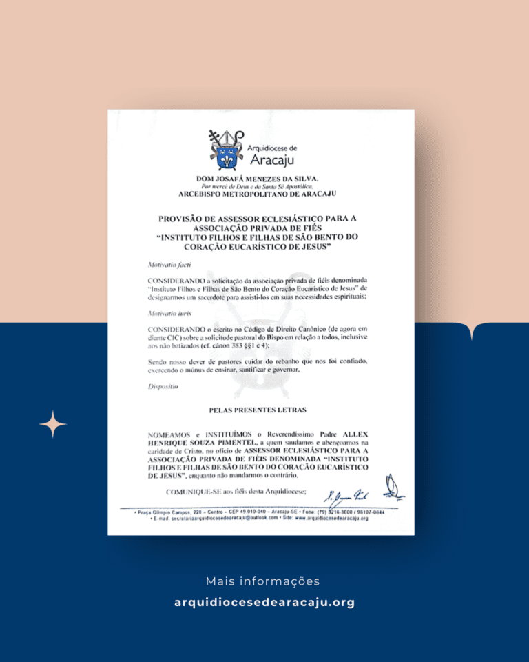

**O padre Allex Henrique Souza Pimentel, pároco da Paróquia Nossa Senhora do Patrocínio e São Bento, em Pedra Mole \(SE\), foi nomeado assessor eclesiástico do Instituto Filhos e Filhas de São Bento do Coração Eucarístico de Jesus\.**

A decisão foi tomada pelo arcebispo metropolitano de Aracaju, Dom Josafá Menezes, e oficializada por meio de provisão publicada pela Chancelaria do Arcebispado\.

A nomeação reforça a ligação entre a Arquidiocese e o Instituto, que tem como missão a vivência dos princípios beneditinos e a adoração ao Santíssimo Sacramento\. O padre Allex Henrique terá a responsabilidade de acompanhar espiritualmente os membros da fraternidade e orientar a comunidade em sua missão pastoral\.

**Sobre o Instituto**

O Instituto Filhos e Filhas de São Bento do Coração Eucarístico de Jesus é uma fraternidade de vida religiosa composta por três ramos: masculino, feminino e leigos consagrados\. Fundado na Arquidiocese de Aracaju, tem como base a espiritualidade beneditina e a devoção à Santíssima Eucaristia\.

O instituto foi criado a partir da experiência do fundador, Abba Francisco, que identificou na adoração eucarística uma fonte inesgotável de santidade\. Ele ensina que _“na adoração buscamos preencher nosso interior da presença de Jesus Ressuscitado, para ir ao encontro do Cristo crucificado que está nos irmãos necessitados, daqueles que são pobres dos bens espirituais e materiais”\._

Além da vida de oração, os membros do Instituto dedicam\-se ao trabalho pastoral e social, atendendo comunidades carentes e promovendo atividades missionárias\. A instituição se alinha ao chamado do papa Francisco para uma “Igreja em saída”, que leva a fé às periferias existenciais e geográficas\.

**A nomeação do padre Allex Henrique reforça o compromisso do Arcebispado de Aracaju com a missão do Instituto, garantindo suporte espiritual e pastoral para seu crescimento e atuação na Igreja\.**

_Da redação, __**Layla Kamila**__\(DRT – 2916/SE\) Assessoria de Comunicação \(ASCOM\), com informações da PASCOM\._

_Disponível em:_ [_Arquidiocese de Aracaju_](https://arquidiocesedearacaju.org/dom-josafa-nomeia-assessor-eclesiastico-para-o-instituto-filhos-e-filhas-de-sao-bento/)